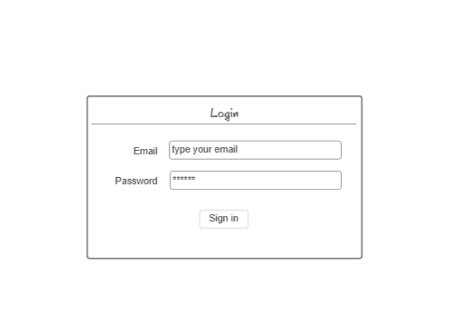
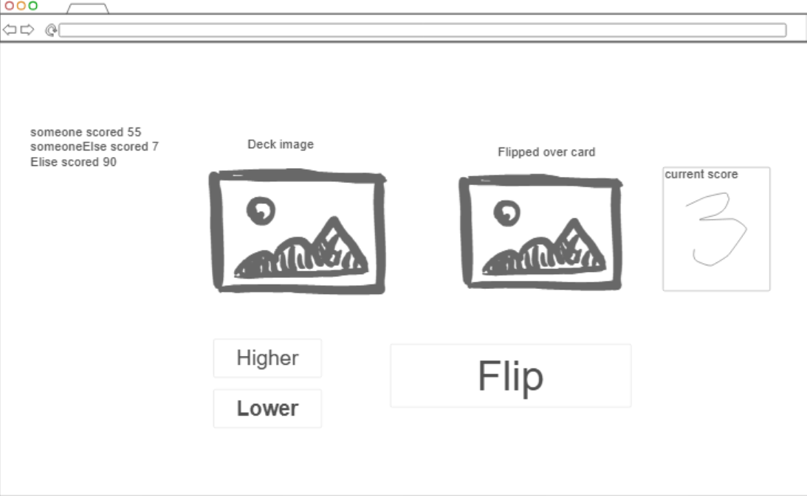
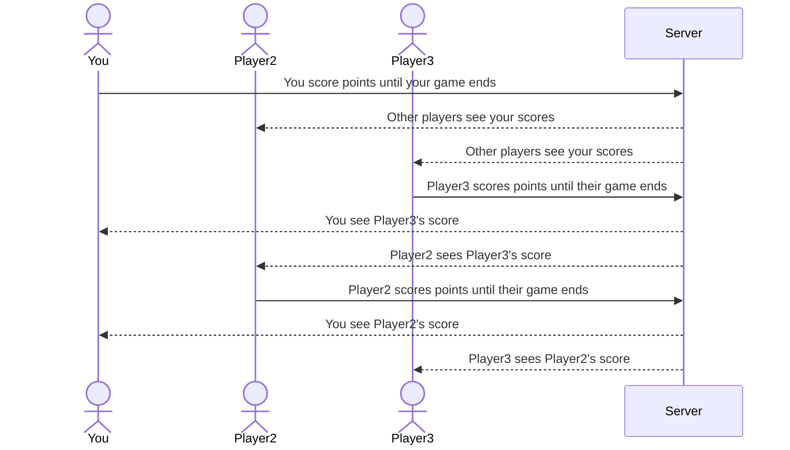

# Higher or Lower Game

[My Notes](notes.md)

This website will be a higher or lower game. Players will guess if the next card is higher or lower than the last and if they guess correctly, they get to keep playing and their score increases. Once the player's game ends their score is shared with other players

> [!NOTE]
>  This is a template for your startup application. You must modify this `README.md` file for each phase of your development. You only need to fill in the section for each deliverable when that deliverable is submitted in Canvas. Without completing the section for a deliverable, the TA will not know what to look for when grading your submission. Feel free to add additional information to each deliverable description, but make sure you at least have the list of rubric items and a description of what you did for each item.

> [!NOTE]
>  If you are not familiar with Markdown then you should review the [documentation](https://docs.github.com/en/get-started/writing-on-github/getting-started-with-writing-and-formatting-on-github/basic-writing-and-formatting-syntax) before continuing.

## 🚀 Specification Deliverable

> [!NOTE]
>  Fill in this sections as the submission artifact for this deliverable. You can refer to this [example](https://github.com/webprogramming260/startup-example/blob/main/README.md) for inspiration.

For this deliverable I did the following. I checked the box `[x]` and added a description for things I completed.

- [x] Proper use of Markdown
- [x] A concise and compelling elevator pitch
- [x] Description of key features
- [x] Description of how you will use each technology
- [x] One or more rough sketches of your application. Images must be embedded in this file using Markdown image references.

### Elevator pitch

This website will be a higher or lower game. Players will guess if the next card is higher or lower than the last and if they guess correctly, they get to keep playing and their score increases. Once the player's game ends their score is shared with other players

### Design

Two pages. A login page and a page for playing the game. The login page will have a place for inputting email and password and a button to login. 
The page for the game will have buttons for picking higher or lower and submitting your answer. It will also have a place to display other player's scores. It will also display the previous card and the deck

Here is a sequence diagram of how messages will be sent to other players

### Key features

- See other players' scores in realtime
- The ability to switch between higher or lower before you hit the flip button to submit your guess
- Display of current score

### Technologies

I am going to use the required technologies in the following ways.

- **HTML** - Two pages. One page for logging in and another page for playing the game.
- **CSS** - a nice color scheme. button highlighting during play. make it so the website works on different screen sizes.
- **React** - Bottons will update the users choice, flip the cards, and route between pages.
- **Service** - Endpoints for: logging in, switching between higher and lower, calculating score, and storing/retrieving scores. Third party call to get a deck of cards.
- **DB/Login** - Securely store usernames, passwords. Logs in and registers the user. The user can't play unless they are logged in. Also store user scores
- **WebSocket** - Users' scores are sent to other players from the server in realtime.

## 🚀 AWS deliverable

For this deliverable I did the following. I checked the box `[x]` and added a description for things I completed.

- [x] **Server deployed and accessible with custom domain name** - [My server link](https://startup.higherorlower.click/).

## 🚀 HTML deliverable

For this deliverable I did the following. I checked the box `[x]` and added a description for things I completed.

- [x] **HTML pages** - I created 3 pages. A main login page, a gameplay page, and a scores page
- [x] **Proper HTML element usage** - I used several elements includeing paragraphs, h1, div, and forms
- [x] **Links** - I have links between the html pages and a link to my github.
- [x] **Text** - I included text on each page. Some examples are "Please predict whether the next card value will be higher or lower!", the text in the tables, and "Login to Play!"
- [x] **3rd party API placeholder** - I have card images as a placeholder for the card api I will use later
- [x] **Images** - I have images for the deck of card and single card
- [x] **Login placeholder** - I have a page to login
- [x] **DB data placeholder** - the "scores" page
- [x] **WebSocket placeholder** - I have a section at the top of the gameplay page that will be updated with other players' scores.

## 🚀 CSS deliverable

For this deliverable I did the following. I checked the box `[x]` and added a description for things I completed.

- [x] **Header, footer, and main content body** - I created a main.css that makes the header, footer, and body a specific color and font. it also sets the size of the header, the footer, and the content body. I also made it so the footer sticks to the bottom of the page as you scroll
- [x] **Navigation elements** - I used bootstrap and css to make the navigation bar at the top of each page look nice and stay consistent.
- [x] **Responsive to window resizing** - I made it so the header and footer disappear when the window shrinks to a certain size. I also used flex so that things still look nice as the window grows and shrinks
- [x] **Application elements** -  I made it so the card image shrinks and grows as the page size shrinks and grows. I also added an animation to flip the card that I will use JavaScript later on to make it play when you click the flip button. Additionally, I made all of the buttons look nice.
- [x] **Application text content** - I added a default font for the page. I also added a cool shadow when you hover over the navigation text. Also I put the text in flex boxes so it resizes as you change the page size.
- [x] **Application images** - I have a card image that I set the height for. I also have the back of the card hidden behind the front of the card so that I can create a flipping animation later.

## 🚀 React part 1: Routing deliverable

For this deliverable I did the following. I checked the box `[x]` and added a description for things I completed.

- [x] **Bundled using Vite** - I completed this part of the deliverable.
- [x] **Components** - I created a scores.jsx, game.jsx, login.jsx, and index.jsx
- [x] **Router** - I added rounter in index.jsx that switches between scores.jsx, game,jsx, and login.jsx when you click on the navigation bar buttons

## 🚀 React part 2: Reactivity

For this deliverable I did the following. I checked the box `[x]` and added a description for things I completed.

- [x] **All functionality implemented or mocked out** - I mocked out functionality for: logging in, playing the game (generating a random car, keeping track of the previous card, and assessing if the player guessed correctly if the new card would be higher or lower), updating "other players' scores" after they lose a game, and keeping track of highscores to be displayed on the "scores" page.
- [x] **Hooks** - I used useState (found in app.jsx, game.jsx, unauthenticated.jsx, and scores.jsx) and useEffect (found in game.jsx, otherScores.jsx, and scores.jsx) hooks

## 🚀 Service deliverable

For this deliverable I did the following. I checked the box `[x]` and added a description for things I completed.

- [X] **Node.js/Express HTTP service** - I have several node.js endpoints that are connected to my frontend using express
- [X] **Static middleware for frontend** - I used Express static middleware in the front end
- [X] **Calls to third party endpoints** - calls to "deckofcardsapi.com" on line 43 of game.jsx used to draw a new card
- [X] **Backend service endpoints** - endpoints to register a new user, login a user, send scores, update scores, send high scores, update high scores.
- [X] **Frontend calls service endpoints** -  calls service to login or register. sends an unauthorized message if the login is incorrect. calls to service endpoints in game.jsx and scores.jsx to retrieve and post scores.

## 🚀 DB/Login deliverable

For this deliverable I did the following. I checked the box `[x]` and added a description for things I completed.

- [ ] **User registration** - I did not complete this part of the deliverable.
- [ ] **User login and logout** - I did not complete this part of the deliverable.
- [ ] **Stores data in MongoDB** - I did not complete this part of the deliverable.
- [ ] **Stores credentials in MongoDB** - I did not complete this part of the deliverable.
- [ ] **Restricts functionality based on authentication** - I did not complete this part of the deliverable.

## 🚀 WebSocket deliverable

For this deliverable I did the following. I checked the box `[x]` and added a description for things I completed.

- [ ] **Backend listens for WebSocket connection** - I did not complete this part of the deliverable.
- [ ] **Frontend makes WebSocket connection** - I did not complete this part of the deliverable.
- [ ] **Data sent over WebSocket connection** - I did not complete this part of the deliverable.
- [ ] **WebSocket data displayed** - I did not complete this part of the deliverable.
- [ ] **Application is fully functional** - I did not complete this part of the deliverable.
